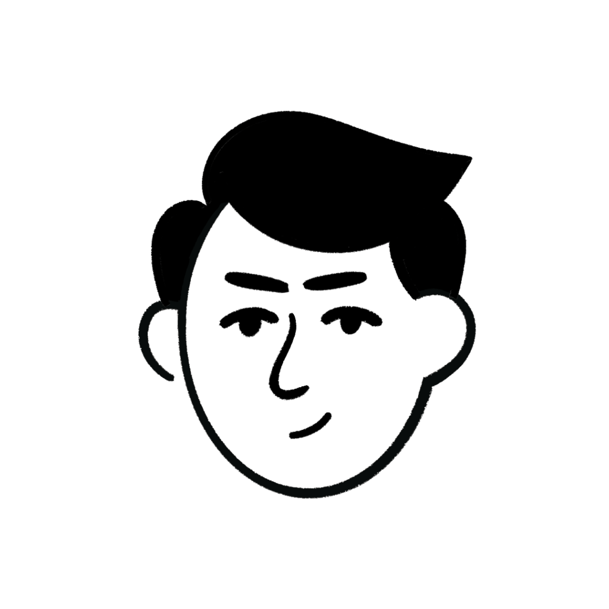

## L'équipe

Svetlana Preux-Nigay

Mattias Guittari

Dounia Bouhayouf

## Le projet

Description du projet

## Technos

**Front-end**

- JavaScript
- React
- TailwindCSS
- React-player-audio
- Formik

**Back-end**

- Node
- Express
- Jasonwebtoken
- Nodemon
- Argon2
- Joi
- Dotenv
- Postman
- Multer

## Organisation
